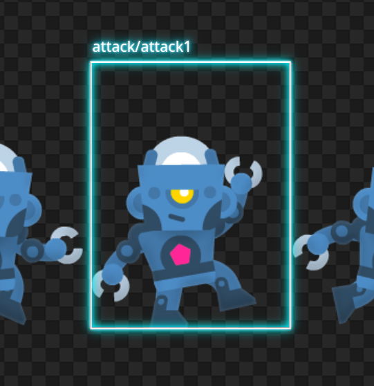
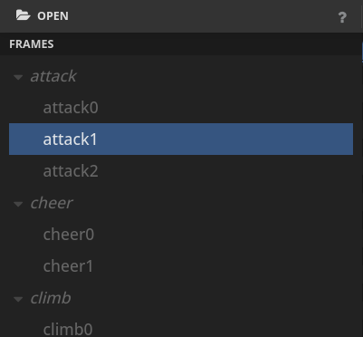

# Sprite Atlas Preview

A simple tool to visualise several types of sprite atlas.

https://sprite-atlas-preview.web.app/

* Features
* How to use it
* Development
* TODO


# Features

## File Types

Supported **Atlas** formats:

* Phaser (JSON Hash)

Supported **Image** formats:
* .png
* .jpg
* .webp
* .gif

## Atlas View


The main section of the tool. This shows the entire atlas file as is and make possible to select individual frames.

### Frame selection



You can look for frames inside the atlas and select them. This make the process of finding individual frames easier.

The selected frame is highlighted and its name is shown. You can select the frame directly on the [Atlas View](#atlas-view) or on the [Frames Tree](#frames-tree).

### Other features

* **Zoom**: zoom in and out the atlas with the `ctrl + mouse wheel`.
* **Pan**: pan the atlas view with `mouse middle button`

## Properties panel


A collepsable panel that shows the selected frame properties like its location and whether it's rotated or trimmed, for example.

## Frames Tree



A tree showing frame names and hierarchy. You can select individual frames or frame groups.

### Frame groups


Groups are made by naming the frames with the `/` separator. 

Example: the frames:
* `Characters/Adventurer/action1`
* `Characters/Adventurer/action2`
* `Characters/Female/action1`
* `Characters/Female/action2`

will generate a tree with the following hierarchy:

```
Characters/
  Adventurer/
    action1
    action2
  Female/
    action1
	 action2
```

You can organize your assets like this to easier maintainance and integration.

## Frame View


View the selected frame isolated. Like the [Atlas View](#atlas-view) you can zoom in/out and pan the area.

### 9-Slice editor


Edit 9-slice information of the selected frame by dragging the dashed lines around it.

> This is a preview-only feature for now and can't save the information into the file. Use it to configure your development tool. 

### 9-slice panel


This panel shows the 9-slice properties of the selected frame.

# How to use it

Click on the button "OPEN ATLAS FILES" to open the dialog. Find your atlas files and select both to open: the .json AND the .png/.jpg/.webp

> IMPORTANT: You HAVE to select **both** files. For now the tool can't open files that are not specifically requested by the user.

There is an example file inside the `example/` folder. Example credits:
* Assets: [Kenney Assets](https://www.kenney.nl/)
* PNG Compression: [Tiny PNG](https://tinypng.com/)
* Packing tool: [Texture Packer](https://www.codeandweb.com/texturepacker)

Now you can **[select frames](#frame-selection)** by clicking on them inside the [Atlas View](#atlas-view) or the [Frames Tree](#frames-tree). In the latter you can also select **[frame groups](#frame-groups)**. In all cases bothe the [Atlas View](#atlas-view) and the [Frames Tree](#frames-tree) will highlight the selected frames.

With a frame selected you can check its properties inside the **[properties panel](#properties-panel)** or enter the **[Frame View](#frame-view)** to check it isolated from other frames. There you can edit the 9-slice properties [using the dashed lines around the frame](#9-slice-editor) and check these properties inside the **[9-slice panel](#9-slice-panel)**. _For now nothing can be saved_.

# Development

If you want to help developing features for this tool you can do it by cloning this project and making a pull request.

## Prerequisites

* [Node](https://nodejs.org)
* [npm](https://www.npmjs.com/) or other similar tool

## Commands

The following commands are useful to test your code.

* **Install dependencies**. As soon as you clone the project, run the following command to install all the dependencies:
	```
	npm install
	```

* **Test locally**. This command will run and serve the files locally at `http://localhost:8080`:
	```
	npm start
	```

* **Run in development mode**. This will do the same as the local test but also watch all files, refreshing the browser automatically when they change:
	```
	npm run dev
	````

* **Clear**. This will clear all the locally generated files to avoid eventual caching.
	```
	npm run clear
	```

# TODO

* support all types of sprite atlases (use Texture Packer as guide)
* support sprite sheets
* save 9-slice data
* infinite pan
* select a single file, open both
* options:
	* highlight color
	* background pattern
	* show full frame names in atlas view
* standalone version (?)

---

> TODO:
> * badges
> * logo and icon
> * screenshot
> * proper description
> * how to use
> * how to develop

