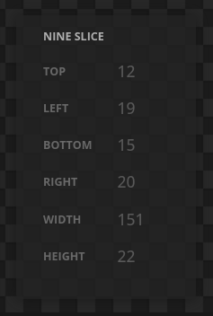

# Sprite Atlas Preview

A simple tool to visualize several types of sprite atlas.

https://sprite-atlas-preview.web.app/


# Table of Contents

- [How to use it](#how-to-use-it)
- [Features](#features)
- [Development](#development)
- [TODO](#todo)

# How To Use It

Click on the button "OPEN" to invoke the open files the dialog. Find your atlas files and select both to open: the .json AND the
.png/.jpg/.webp

> IMPORTANT: You HAVE to select **both** files. For now the tool can't open files that are not specifically requested by the user.

There is an example file inside the `example/` folder. Example credits:

- Assets: [Kenney Assets](https://www.kenney.nl/)
- PNG Compression: [Tiny PNG](https://tinypng.com/)
- Packing tool: [Texture Packer](https://www.codeandweb.com/texturepacker)

With the files loaded you can:

- **[select frames](#frame-selection)** using the [Atlas View](#atlas-view) or the [Frames Tree](#frames-tree)
- with a frame selected you can check its properties inside the **[frames properties](#properties-panel)**
- also see and edit information about [9-slice](#9-slice-editor)
- with multiple frames selected you preview an animations made with them

_For now no atlas property can be saved_.

# Features

## File Types

Supported **Atlas** formats:

- Phaser (JSON Hash)

Supported **Image** formats:

- .png
- .jpg
- .webp
- .gif

### Global commands

Commands that are the same for all views:

- **Zoom**:
  - zoom in: `ctrl+"+"`
  - zoom ou: `ctrl+"-"`
  - zoom in/out: `ctrl + mouse wheel`
  - reset zoom: `ctrl+0`.
- **Pan**: use `mouse middle button`, `mouse wheel` or keyboard arrow keys to pan the view.
- **Reset scale and pan**: use `Tab` key
- **Copy the selected frames path**: use `ctrl+c` to copy the selected frames path anywhere in the tool.

## Atlas View


The main section of the tool. This shows the entire atlas file as is and make possible to select individual frames.

### Frame Selection


You can look for frames inside the atlas and select them. This makes the process of finding individual frames easier.

The selected frame is highlighted and its name is shown. You can select the frame directly on the [Atlas View](#atlas-view) or on the
[Frames Tree](#frames-tree).

### Commands

- **Select multiple frames** using `ctrl + click` inside the view. The order you select the frames are important to the
  [Animation View](#animation-view)

## Properties Panel


A collapsable panel that shows the selected frame properties inside the atlas like its location and whether it's rotated or trimmed, for
example.

## Frames Tree


A tree showing frame names and hierarchy. You can select individual or multiple frames or [frame groups](#frame-groups).

### Commands

- **Select multiple sparse frames** using `ctrl + click`
- **Select multiple consecutive frames** using `shift + click` (the order you select the first and the last frame matters to the
  [Animation View](#animation-view))

### Frame Groups


Groups are made by naming the frames with the `/` separator.

Example: the frames:

- `Characters/Adventurer/action1`
- `Characters/Adventurer/action2`
- `Characters/Female/action1`
- `Characters/Female/action2`

will generate a tree with the following hierarchy:

```
Characters/
  Adventurer/
    action1
    action2
  Female/
    action1
	 action2
```

You can organize your assets like this to easier maintainance and integration.

## Frame View


View the selected frame isolated. Like the [Atlas View](#atlas-view) you can zoom in/out and pan the area.

### 9-Slice Editor


Edit 9-slice information of the selected frame by dragging the dashed lines around it.

> This is a preview-only feature for now and can't save the information into the file. Use it to configure your development tool.

### 9-slice Panel



This panel shows the 9-slice properties of the selected frame.

### Commands

- **Move 9-slice handle** with the keyboard arrow keys when a handle is selected.

## Animation View


When you select multiple frames, being them consecutive or sparse, you can preview an animation using them.

A small number appears at the right of those selected frames. This is the order you've select them and it's used as the order the frames
will be played in the animation preview.

### Animation controls


You can control the animation frame and playback features with the animation controls panel. The controls are:

- Toggle play / pause
- Stop
- Previous frame
- Next frame
- Seek bar
- Toggle loop
- Toggle yoyo
- Frame rate

### Commands

- **Play / pause** with `space bar`
- **Stop** with `x`
- **Go to previous frame** with `,` / `<`
- **Go to next frame** with `.` / `>`
- **Toggle loop** with `l`
- **Toggle yoyo** with `y`
- **Decrease frame rate by 1** with `[`
- **Increase frame rate by 1** with `]`

## More info

This tool uses local storage (cookies) to save some ui properties to better usability between runs. The properties saved are:

- Frame properties: visibility state (collapsed / expanded)
- Animation View: state of loop option
- Animation View: state of yoyo option
- Animation View: frame rate selected

# Development

If you want to help developing features for this tool you can do it by cloning this project and making a pull request.

## Prerequisites

- [Node](https://nodejs.org)
- [npm](https://www.npmjs.com/) or other similar tool

## Commands

The following commands are useful to test your code.

- **Install dependencies**. As soon as you clone the project, run the following command to install all the dependencies:

  ```
  npm install
  ```

- **Test locally**. This command will run and serve the files locally at `http://localhost:8080`:

  ```
  npm start
  ```

- **Run in development mode**. This will do the same as the local test but also watch all files, refreshing the browser automatically when
  they change:

  ```
  npm run dev
  ```

- **Clear**. This will clear all the locally generated files to avoid eventual caching.
  ```
  npm run clear
  ```

# TODO

- support all types of sprite atlases (use Texture Packer as guide)
- support sprite sheets
- save 9-slice data
- select a single file, open both
- options:
  - highlight color
  - background pattern
  - show full frame names in atlas view
- standalone version (?)
